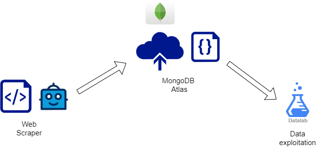
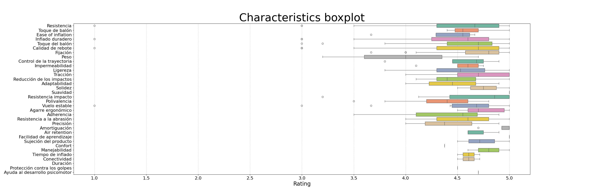

# DecaScraper

Decathlon Web Scraping Project.

## Project description

This project is a part of a bigger purpose. The file `scraper.py` contains all the source code generated to scrap data from www.decathlon.es/es. The data is dynamically uploaded to a MongoDB Atlas Shared Cluster. The scrapped data includes:

- **products**: Price, name, description, discount etc... Identified bye a unique ID.
- **product_reviews**: author data, text, rating, usage, product id.
- **product_characteristics**: title , description, product_id.

## System Architecture

## Project structure

- the folder `utils` contains the helper functions.
- The folder `data_visualization` contains the source code generated to make the figures.
- The folder `data/` contains the scrapped data in _.csv_ format.
- The folder `images/` contains examples obtained after exploiting the data.
  - **Example: _What is the most valuable product characteristic for end-users?_**
    

## Usage:

- Scraper module:
  - Run: `python -m scraper *<queries> --get <information>`.
  - Example: `python -m scraper balón zapatillas --get products`.
  - Example 2: `python -m scraper camiseta --get reviews`.
